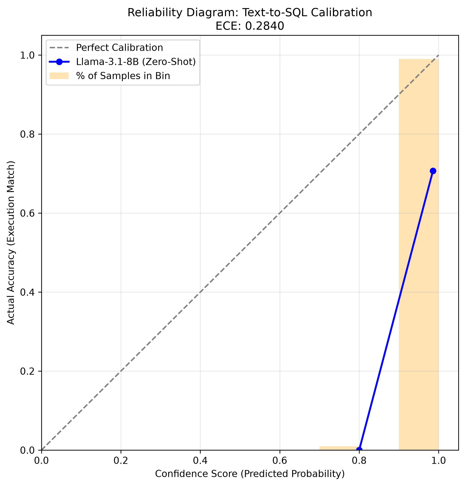

# Evaluating Text-to-SQL Calibration and LLM Overconfidence

## Abstract
As Generative AI is increasingly deployed in enterprise environments, model reliability and calibration become critical safety metrics. This project evaluates the confidence calibration of Open-Source LLMs (Llama-3.1-8B) on the complex **Spider** Text-to-SQL benchmark. 

## Methodology
1. **Dataset:** Evaluated 100 zero-shot natural language queries against complex SQLite schemas.
2. **Inference:** Prompted the model to output a JSON object containing the generated SQL and a self-assessed `confidence_score` (0.0 to 1.0).
3. **Execution Match:** Bypassed simple string comparison by executing both the LLM-generated SQL and the Gold Standard SQL against local databases to verify identical row outputs.
4. **Calibration Math:** Calculated the **Expected Calibration Error (ECE)** to measure the gap between model confidence and actual execution accuracy.

## Results
The model demonstrated severe overconfidence in its SQL generation capabilities:
* **Overall Accuracy:** 70.0%
* **Average Confidence:** 98.4%
* **Expected Calibration Error (ECE):** 0.2840

## Future Work
* Evaluate post-hoc calibration techniques (e.g., Temperature Scaling) to align confidence with accuracy.
* Expand the evaluation pipeline to multi-turn interactions and larger parameter models.