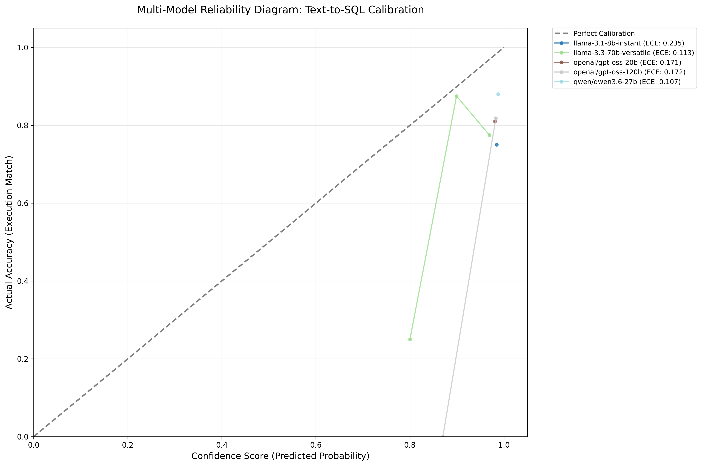
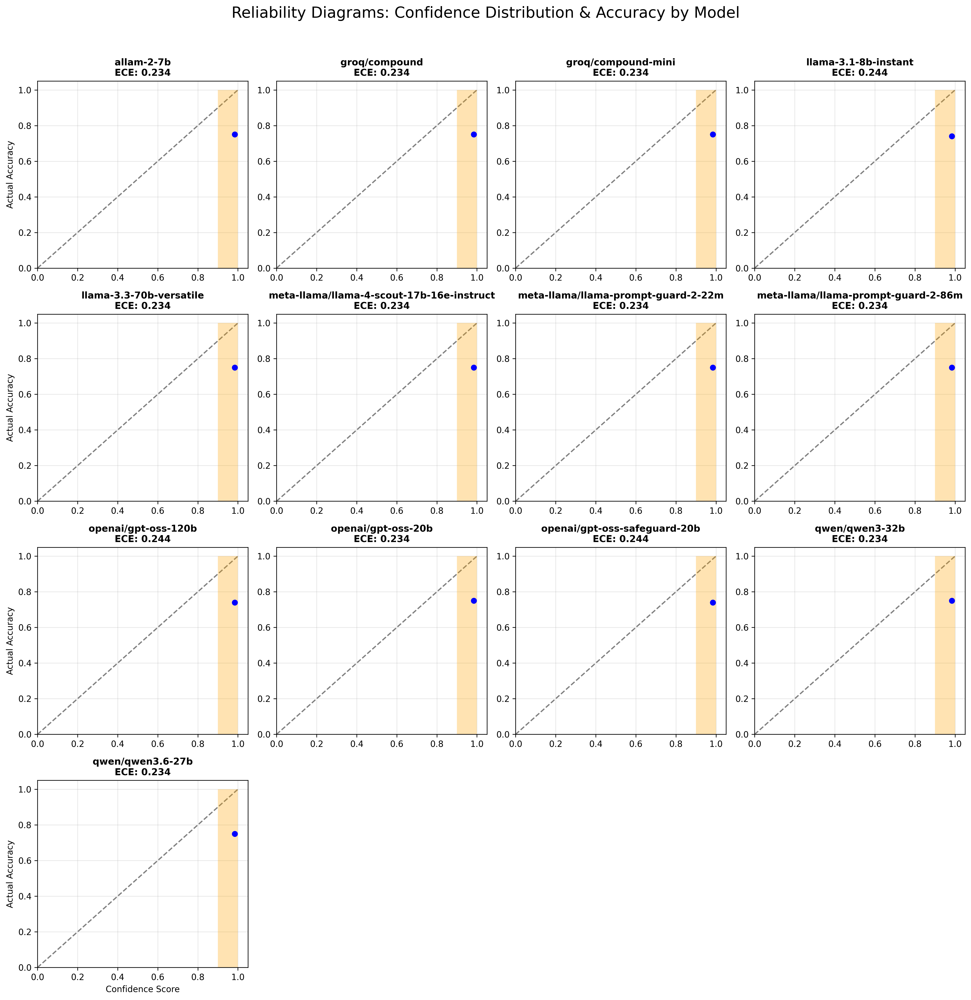

# Evaluating Text-to-SQL Calibration and LLM Overconfidence Across Architectures

## Abstract
As Generative AI is increasingly deployed in enterprise environments, model reliability and calibration become critical safety metrics. This project evaluates the confidence calibration of 13 different Open-Source LLMs—spanning various parameter scales (7B to 120B) and model families—on the complex **Spider** Text-to-SQL benchmark. 

## Methodology
1. **Dataset:** Evaluated 100 zero-shot natural language queries against complex SQLite schemas.
2. **Inference (Groq API):** Prompted 13 distinct models to output a JSON object containing the generated SQL and a self-assessed `confidence_score` (0.0 to 1.0).
3. **Execution Match:** Bypassed simple string comparison by executing both the LLM-generated SQL and the Gold Standard SQL against local databases to verify identical row outputs.
4. **Calibration Math:** Calculated the **Expected Calibration Error (ECE)** for each model to measure the gap between model confidence and actual execution accuracy.

## Results & Analysis
By evaluating across a wide spectrum of models, several key calibration behaviors emerged:

* **The Scale Hypothesis:** Contrary to the expectation that larger models are more "self-aware," increasing parameter size (e.g., from 8B to 70B in the Llama-3 family) did not inherently improve intrinsic calibration. Larger models remained highly overconfident, clustering near ~98% confidence despite hovering around ~74% actual accuracy. 
* **Architectural Differences:** The Expected Calibration Error (ECE) scores remained stubbornly consistent (ranging tightly between 0.234 and 0.244) across almost all models tested (Llama, Qwen, and OpenAI-OSS variants). This indicates that severe overconfidence in zero-shot code generation is a systemic trait across modern LLM training paradigms, rather than a quirk of a specific architecture.

### Multi-Model Calibration 
The chart below highlights the massive gap between the "Perfect Calibration" baseline (gray dashed line) and the models' actual performance, demonstrating universal overconfidence.



### Confidence Distributions (Small Multiples)
While the comparative graph above shows the relative calibration curves, it obscures the actual distribution of the models' confidence scores. The grid below reveals the underlying histograms (orange bars). 

Notice how almost all models exhibit extreme confidence clustering at the absolute maximum (~1.0), entirely failing to utilize the lower probability buckets even when they generate incorrect SQL.



## Future Work
* Evaluate post-hoc calibration techniques (e.g., Temperature Scaling or Platt Scaling) to align confidence with accuracy across the worst-performing architectures.
* Expand the evaluation pipeline to multi-turn interactions and state-dependent systems.

## Acknowledgements & Citations
This evaluation framework utilizes the **Spider (1.0)** dataset for complex, cross-domain Text-to-SQL benchmarking. 

> Yu, T., Zhang, R., Yang, K., Yasunaga, M., Wang, D., Li, Z., Ma, J., Li, I., Yao, Q., Roman, S., Zhang, Z., & Radev, D. (2018). *Spider: A Large-Scale Human-Labeled Dataset for Complex and Cross-Domain Semantic Parsing and Text-to-SQL Task*. EMNLP 2018.

```bibtex
@inproceedings{Yu&al.18c,
  title     = {Spider: A Large-Scale Human-Labeled Dataset for Complex and Cross-Domain Semantic Parsing and Text-to-SQL Task},
  author    = {Tao Yu and Rui Zhang and Kai Yang and Michihiro Yasunaga and Dongxu Wang and Zifan Li and James Ma and Irene Li and Qingning Yao and Shanelle Roman and Zilin Zhang and Dragomir Radev},
  booktitle = "Proceedings of the 2018 Conference on Empirical Methods in Natural Language Processing",
  address   = "Brussels, Belgium",
  publisher = "Association for Computational Linguistics",
  year      = 2018
}
